# ATmega128A 기반 I2C RTC 시계 및 복합 사칙연산 계산기 통합 시스템

> **Data Sheet 해석 및 I2C 통신 프로토콜 구현을 통한 하드웨어 제어와 비차단 멀티태스킹 아키텍처 소프트웨어 통합 프로젝트**

---

## 1. 프로젝트 개요

### 🔷 개발 목적
* **데이터시트 레벨 해석**: 제조사에서 제공하는 칩셋 규격서를 정밀 분석하여 레지스터 레벨의 제어 로직을 직접 개발합니다.
* **I2C 통신 체득**: DS1307 RTC 소자와의 핸드쉐이크 과정을 설계하며 2-Wire 인터페이스의 물리 계층 동작 원리를 명확히 이해합니다.
* **기능 통합 및 최적화**: 1ms 마스터 타이머 기반의 비차단(Non-blocking) 스케줄러 위에서 실시간 시간 표출 및 키패드 입력 기반 복합 계산 알고리즘의 시스템 통합을 이뤄냅니다.

### 🔷 개발 환경
* **MCU**: ATmega128 (8-bit AVR)
* **IDE / Tool**: Microchip Studio(Atmel Stduio)
* **Main Comm**: I2C, 4-bit Parallel
* **Analysis**: Oscilloscope (Waveform Debug)

---

## 2. 하드웨어(H/W) 구성 및 회로 설계

### 🗺️ 시스템 전체 회로도 및 결선 외관

| 시스템 실제 결선 외관 (Breadboard) | 시스템 논리 회로도 (KiCad Schematic) |
| :---: | :---: |
| 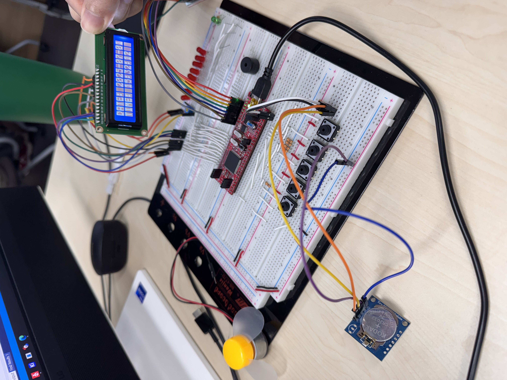 | 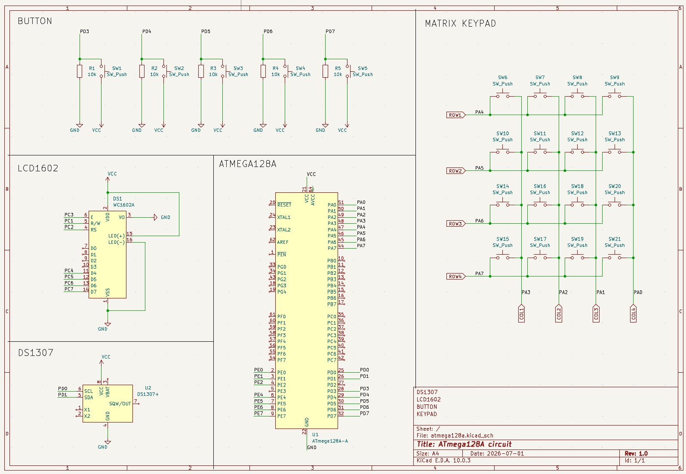 |

### 📊 부품 명세서 (Part List)

| 부품명 | 상세 사양 | 수량 | 주요 역할 |
| :--- | :--- | :---: | :--- |
| **LCD1602** | 16x2 Character, 4-bit Parallel | 1 | 데이터 시각화 출력 장치 |
| **DS1307** | I2C Real-Time Clock | 1 | 실시간 시간 데이터 공급 |
| **Push Switch** | Tact Switch (4-Pin) | 5 | 설정 모드 및 계산기 모드 입력 |
| **Resistor** | 1/4W Axial, 10kΩ | 7 | I2C 풀업 및 스위치 풀다운/풀업 저항 |
| **4x4 Keypad** | Matrix Membrane Type | 1 | 계산기 숫자 및 연산 기호 입력 |
| **MCU** | ATmega128A | 1 | 전체 시스템 로직 및 통신 제어 |

---

## 3. 소프트웨어(S/W) 아키텍처 및 구현 상세

### ⚙️ 3.1 전체 시스템 유한 상태 머신 (FSM)

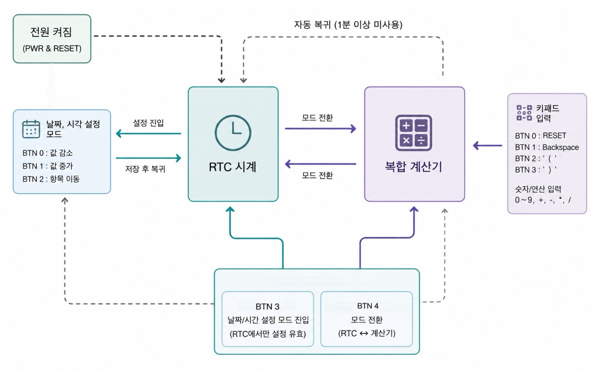

* 시스템 전원이 투입되면 사용자의 입력에 따라 시계 모드, 날짜/시간 설정 모드, 복합 계산기 모드를 교차 전환합니다.
* **자동 복귀 기능**: 계산기 모드 진입 후 1분 이상 미사용(방치) 시 시스템 보호를 위해 시계 화면으로 자발적 자동 복귀하는 예외 처리 엔진이 내장되어 있습니다.

---

### 📺 3.2 캐릭터 LCD1602 드라이버 (4-bit Parallel Bus)

* **초기화 시퀀스 정밀 제어**: 전원 인가 초기 LCD 내부 상태가 불명확한 점을 고려하여, `0x30` 명령을 강제로 3회 연속 전송하는 Software Reset 알고리즘을 구축하여 신뢰성을 확보한 뒤 4비트 모드로 안전하게 전환합니다.
* **동기 제어 타이밍 구현**: 데이터를 버스에 싣고 Enable(E) 핀을 튕길 때 데이터시트에 명시된 1.64ms(Clear Display) 및 일반 명령어 소요 시간을 정밀하게 충족하여 하드웨어 병목 타이밍을 완전히 제어했습니다.

---

### 🕒 3.3 DS1307 실시간 시계 (I2C 통신 및 파형 분석)

* **레지스터 핸들링**: 내부 메모리 주소에 분산된 BCD(이진화 십진수) 포맷 데이터를 읽어와 마스터 10진수로 정렬 가공합니다. 초기 구동 시 클록이 멈추는 현상을 막기 위해 CH(Clock Halt) 비트 자동 클리어 검증 로직을 내장했습니다.
* **오실로스코프 계측 무결성 분석**: 실제 하드웨어 통신 중인 SDA, SCL 라인을 분석하여 I2C 프로토콜 시나리오가 데이터시트 스펙과 완벽하게 일치함을 검증했습니다.

| 1. 시작 주소 지정 파형 (`0xD0 -> 0x00`) | 2. READ 시작 파형 (`0xD1 -> 0x54`) | 3. 분/시/요일/일 읽기 파형 |
| :---: | :---: | :---: |
| 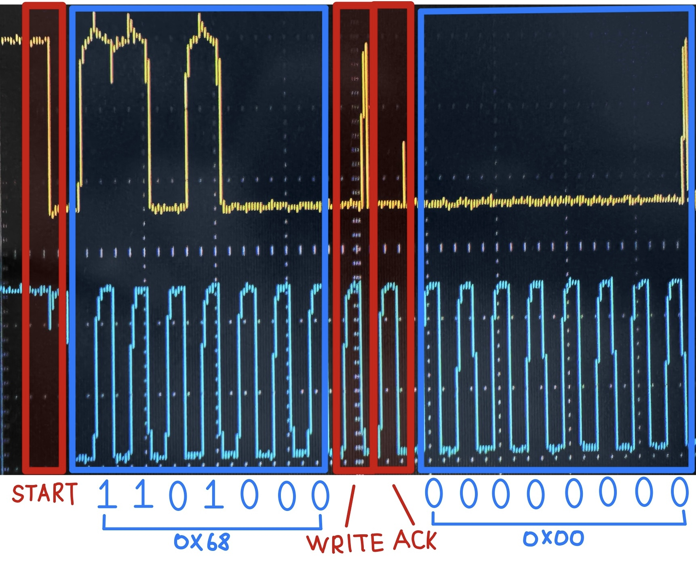 | 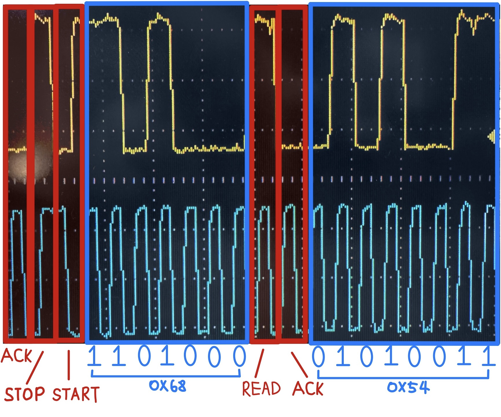 | 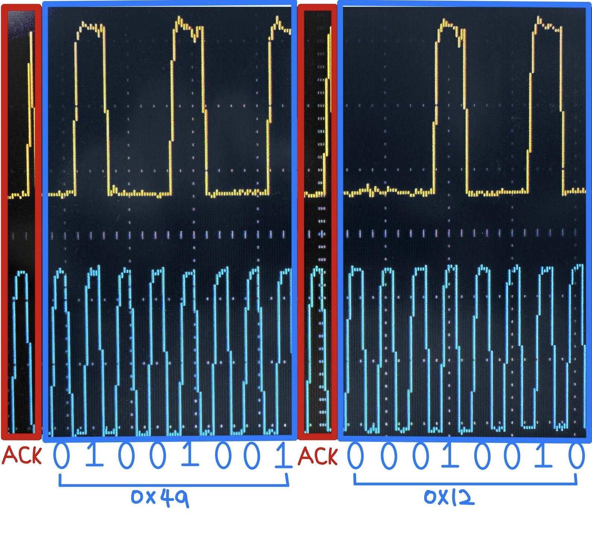 |
| **4. 월/년 읽기 및 마감 파형** | **5. I2C 버스 종합 데이터 파형** | **6. 최종 LCD 시계 표출 결과** |
| 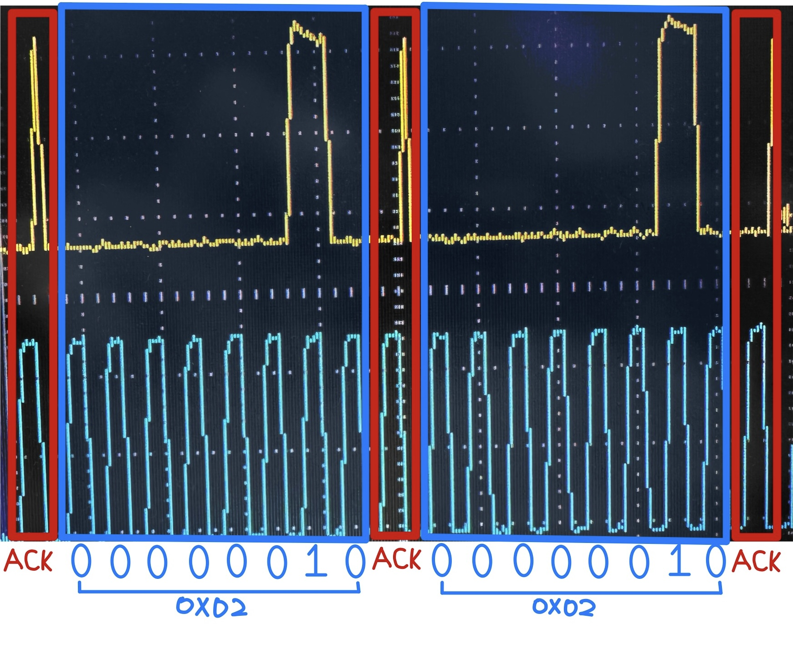 | 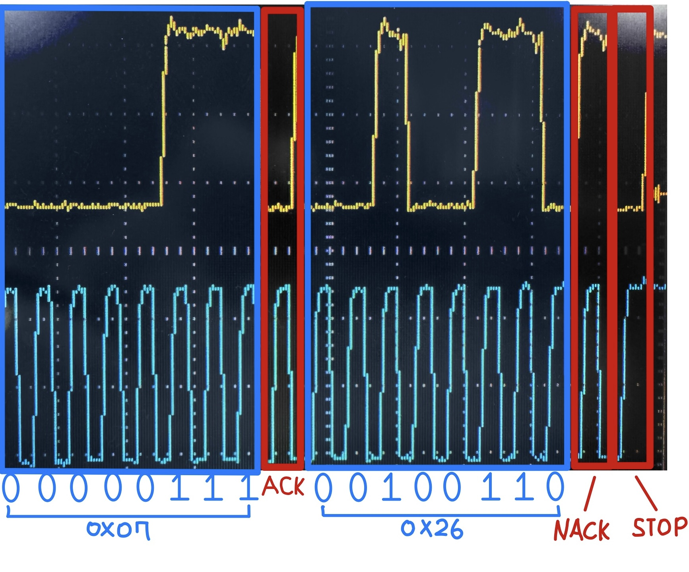 | 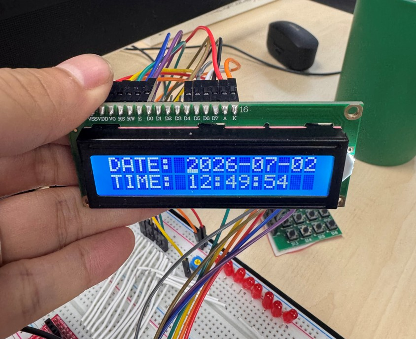 |

---

### 🧮 3.4 복합 계산기 파싱 알고리즘

* **재귀 하향 파서(Recursive Descent Parser)**: 복잡한 연산자 우선순위 및 소괄호 쌍의 예외 처리를 해결하기 위해, 시스템 스택 프레임을 타고 내려가는 재귀적 문법 구문 분석 파싱 엔진을 자력 설계했습니다.
* **재귀 호출 연쇄 구조**: 수식 평가 시 선행 괄호 유효성 검증을 마친 후 최하위 레벨 연산에서 시작하여 곱셈/나눗셈 파서, 최우선순위(괄호 및 숫자 결합) 파서 순서로 호출 연쇄가 진행됩니다. 최우선순위 파서 구동 중 여는 괄호 `(` 포착 시 연산 레벨을 초기화하기 위해 최하위 레벨 파서를 상호 재귀 호출하여 괄호 내부 수식을 최우선 순위로 강제 격파합니다.

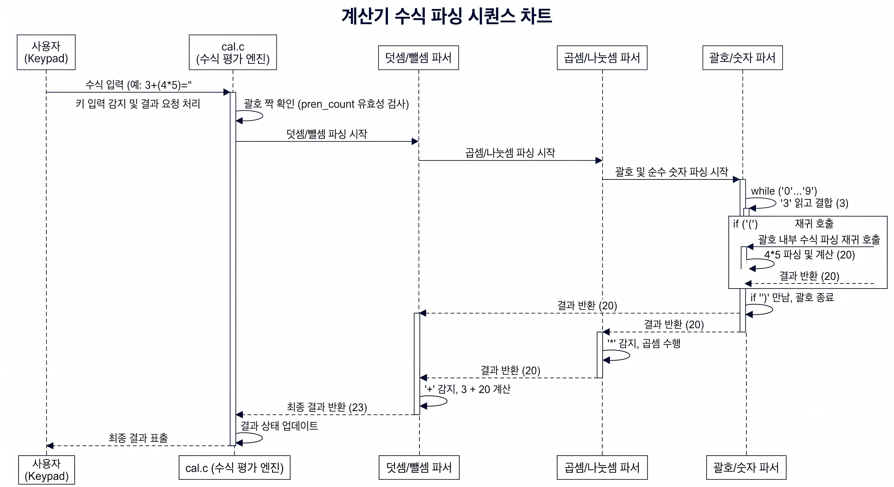

---

### 🏢 3.5 시스템 전체 구조도 (System Architecture)

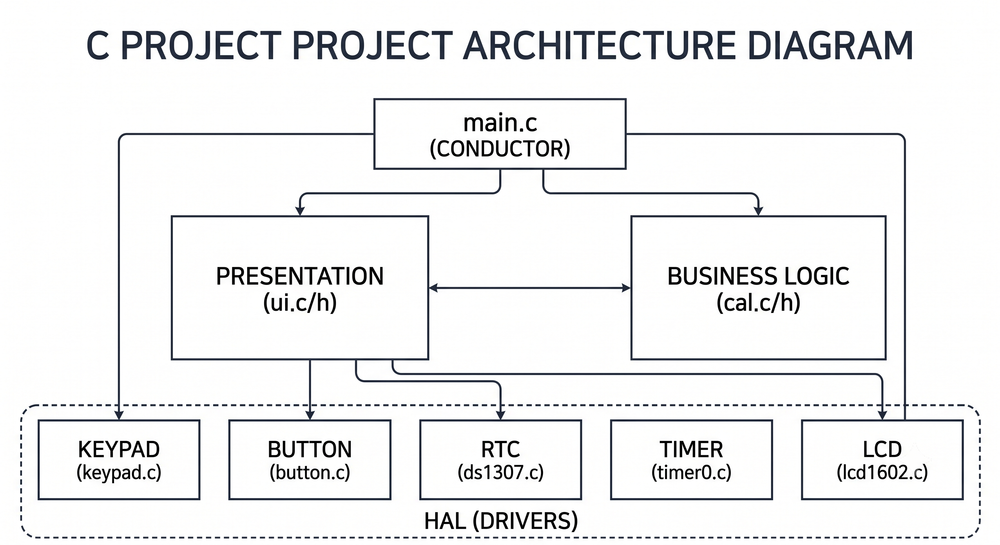

* **독립적 계층 분리**: 마스터 지휘자인 `main.c`를 필두로, 사용자 화면 출력을 담당하는 프레젠테이션 계층(`ui.c`), 수식 알고리즘을 담당하는 비즈니스 로직 계층(`cal.c`), 실제 디바이스 제어를 담당하는 하드웨어 추상화 계층(`HAL / Drivers`)이 상호 간섭 없이 유기적으로 동작하도록 구조화했습니다.

---

## 4. 핵심 트러블슈팅 및 구현 후기

* **LCD 하드웨어 시프트 타이밍 최적화**
  * 명령어의 물리적 실행 시간(1.64ms) 제약을 고려하여 4비트 인터페이스의 타이밍 동기화를 정밀하게 제어함으로써, 긴 수식 입력 시 화면이 부드럽게 밀리는 하드웨어 스크롤 기능을 성공적으로 구현했습니다.
* **오버플로우 방지 및 자체 출력 버퍼 설계**
  * 정수 범위 한계를 극복하기 위해 내부 연산을 64비트 확장 자료형(`int64_t`)으로 설계하고, 컴파일러의 출력 제한을 자체 구현한 문자열 변환 버퍼 함수(`int64_to_str`)로 제어하여 큰 자릿수도 깨짐 없이 정상 계산되도록 완성했습니다.
* **데이터시트 및 I2C 통신 후기**
  * 데이터시트의 타이밍 스펙을 엄격히 준수하는 것이 시스템 신뢰성의 핵심임을 깨달았고, 오실로스코프로 I2C 버스의 실시간 BCD 파형을 직접 계측 및 분석해 보며 임베디드 통신 제어의 깊이를 더한 값진 경험이었습니다.

---

## 5. 시스템 구동 시연 동영상

| 1. Reset 동작 시연 | 2. 계산기 대기 동작 시연 |
| :---: | :---: |
| [Reset 동작](https://github.com/user-attachments/assets/b78caf9c-ed95-4711-8a38-911cbf39adca) | [계산기 대기 동작](https://github.com/user-attachments/assets/9526dc14-fb07-40c4-8e4b-e8f7e06477e3) |
| **3. 계산기 Shift 동작 시연** | **4. 시스템 전체 동작 시연** |
| [계산기 Shift 동작](https://github.com/user-attachments/assets/d007d798-954c-4ccf-9ef9-4953d11a8a9e) | [시스템 전체 동작](https://github.com/user-attachments/assets/0f2ee930-3377-46e6-80b0-7c4bed6878ca) |
